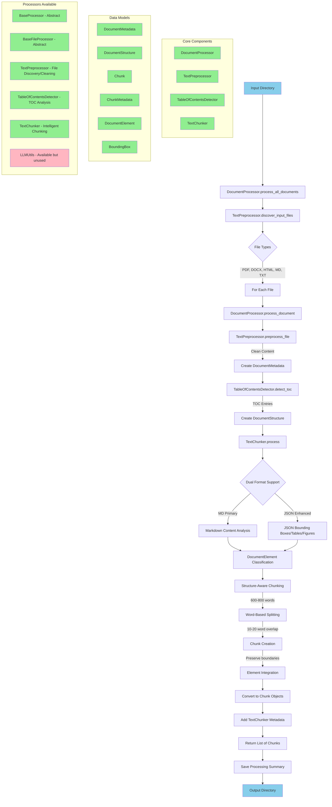

# Graph-RAG Document Processing Workflow

## Current Architecture Diagram

## Architecture Analysis

### ✅ **Currently Used Components:**
1. **DocumentProcessor** - Main orchestrator
2. **TextPreprocessor** - File discovery and content cleaning  
3. **TableOfContentsDetector** - Document structure analysis
4. **TextChunker** - Intelligent chunking with dual format support
5. **Data Models** - Complete model hierarchy (Chunk, DocumentMetadata, etc.)
6. **DocumentElement & BoundingBox** - Structure definitions

### ❓ **Potentially Redundant/Unused:**
1. **LLMUtils** - Created but not integrated into main workflow
2. **BaseProcessor/BaseFileProcessor** - Abstract classes, good for extensibility but could be simplified

### 🔧 **Missing Core Functions:**
1. **JSON/MD File Pair Processing** - TextChunker supports it, but main workflow only processes single files
2. **Embeddings Generation** - Chunk model has embedding field but no processor
3. **Entity Extraction** - ChunkMetadata has fields (regions, metrics, dates) but no extraction logic
4. **Reference Resolution** - Models support inbound/outbound refs but no processor
5. **Table-Specific Processing** - ChunkMetadata has table fields but limited table processing

### 🎯 **Workflow Efficiency:**
- **Good**: Linear, clear flow from input to chunked output
- **Good**: Proper separation of concerns between components
- **Good**: TOC detection integrated with chunking
- **Missing**: Parallel processing capabilities for multiple files
- **Missing**: Validation/quality checks on chunks

### 🚨 **Key Findings:**
1. **Main workflow is complete and functional** ✅
2. **TextChunker dual format support is ready but not fully utilized** ⚠️
3. **LLMUtils created but not integrated** ⚠️
4. **Advanced chunk metadata fields defined but not populated** ⚠️